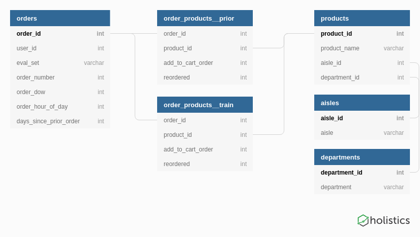

# Predicting Customer Repurchases at Instacart

To begin, extract the [Instacart Online Grocery Shopping Dataset](https://www.instacart.com/datasets/grocery-shopping-2017) in the `data` directory, then follow the notebooks linked in the project outline below. 

## Project Outline

1. [Creating `prior`, `train` and `all_products` datasets](notebooks/01-make_prior_and_training_datasets.ipynb) 
2. [Creating features for `training` set based on `prior` ordering data](notebooks/02-creating_features_for_modelling.ipynb)
3. [Classification model development and evaluation](notebooks/03-model_development_and_evaluation.ipynb)

## Description of directory contents

- `data`: project data (raw data files must be downloaded from Instacart as per Terms of Service) 
- `docs`: project documentation
- `image`: project images and figures
- `notebooks`: Jupyter notebooks containing project code
- `slides`: project presentations
- `src`: custom Python3 scripts

## References

1. “The Instacart Online Grocery Shopping Dataset 2017”, Accessed from https://www.instacart.com/datasets/grocery-shopping-2017 on 24th June 2019.
